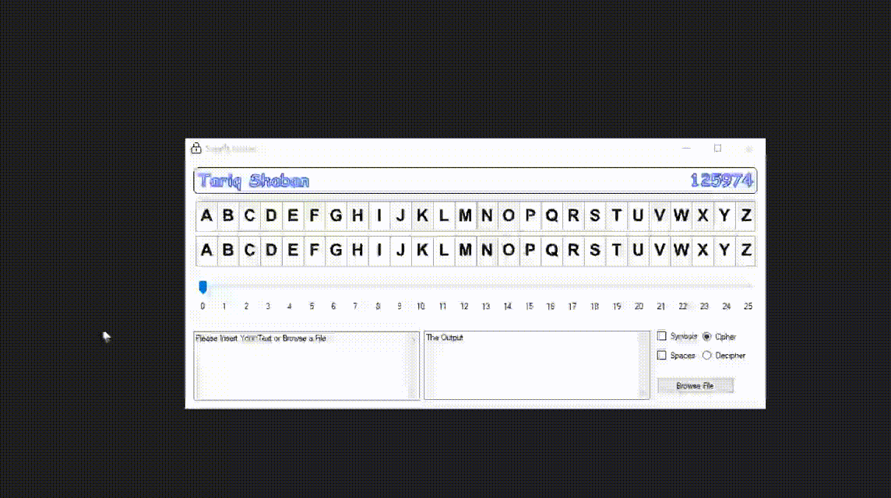
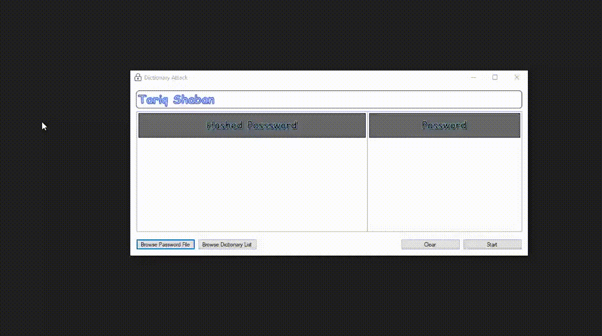

Bachelor Projects Repository
==============================
This is an encapsulation of most of the projects that I have made during my bachelor's degree.

Since these projects were made long ago, it is highly expected to run into code that does not follow clean code
principles and conventions.

Getting Started
------------
Clone the project from GitHub

`$ git clone https://github.com/tariqshaban/bachelor-projects.git`

No further configuration is required.

Repository Structure
------------

    ├── README.md
    │
    ├── 2nd_year
    │   │── 1st_semester
    │   │   └── cis341_web_application
    │   │       └── library_application_with_messenger
    │   │── 2nd_semester
    │   │   └── se412_android
    │   │       └── hotel
    │   └── 3rd_semester_summer
    │       │── extracurricular_activities
    │       │   │── btr112
    │       │   └── tengu_war
    │       └── se310_visual_programming
    │           └── wmd_run
    │
    ├── 3rd_year
    │   └── 1st_semester
    │       │── cis421_oracle
    │       │   └── soccer_dashboard
    │       └── cis433_security
    │           │── offline_dictionary_attack
    │           │── simple_cipher
    │           └── sql_injection
    │
    └── 4th_year
        └── 1st_semester
            └── cis492_graduation_project_II
                └── just_bus

| Project (Reverse Order)                                                                                               | Languages/Frameworks              | Ease of Configuration | Preview                                                                                                                                  |
|-----------------------------------------------------------------------------------------------------------------------|-----------------------------------|-----------------------|------------------------------------------------------------------------------------------------------------------------------------------|
| [JUST Bus](4th_year/1st_semester/cis492_graduation_project_II/just_bus)                                               | Flutter, .NET Web API, SQL Server | 🟥                    |                                                                                              |
| [SQL Injection](3rd_year/1st_semester/cis433_security/sql_injection)                                                  | HTML, CSS, JS, PHP, MySQL         | 🟧                    |                                                                                         |
| [Simple Cipher](3rd_year/1st_semester/cis433_security/simple_cipher)                                                  | WinForms (C#)                     | 🟩                    |                                                                                         |
| [Offline Dictionary Attack](3rd_year/1st_semester/cis433_security/offline_dictionary_attack)                          | WinForms (C#)                     | 🟩                    |                                                                             |
| [Soccer Dashboard](3rd_year/1st_semester/cis421_oracle/soccer_dashboard)                                              | PL/SQL (Oracle APEX)              | 🟥                    |                                                                                      |
| [WMD Run](2nd_year/3rd_semester_summer/se310_visual_programming/wmd_run)                                              | WinForms (C#)                     | 🟩                    |                                                                                               |
| [Tengu War](2nd_year/3rd_semester_summer/extracurricular_activities/tengu_war)                                        | Unity (C#)                        | 🟧                    |                                                                                             |
| [BTR-112](2nd_year/3rd_semester_summer/extracurricular_activities/btr112)                                             | Unity (C#), Vuforia SDK           | 🟧                    |  *screen distortion is caused by implementing a deprecated framework version on a x64 emulator |
| [Hotel](2nd_year/2nd_semester/se412_android/hotel)                                                                    | Android (Java), XML, SQLite       | 🟩                    |                                                                                                 |
| [Library Application with Messenger](2nd_year/1st_semester/cis341_web_application/library_application_with_messenger) | HTML, CSS, JS, PHP, MySQL         | 🟧                    |                                                                    |

--------